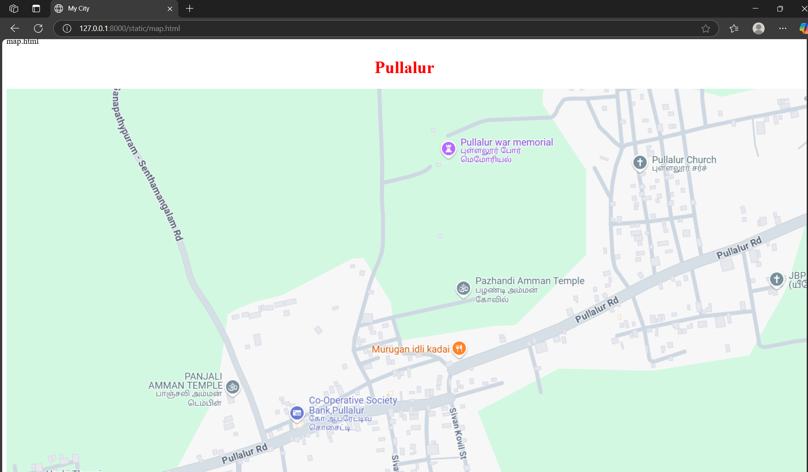
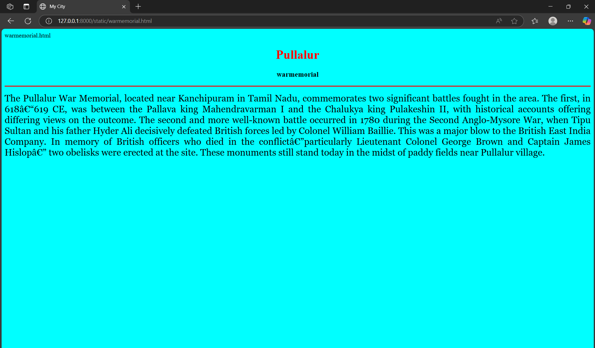
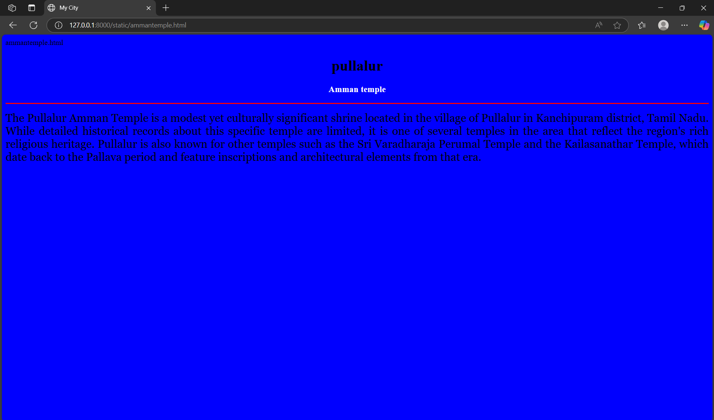
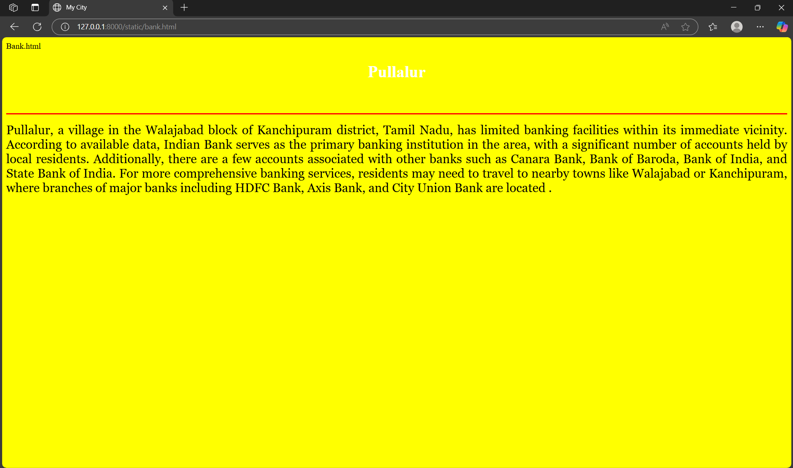
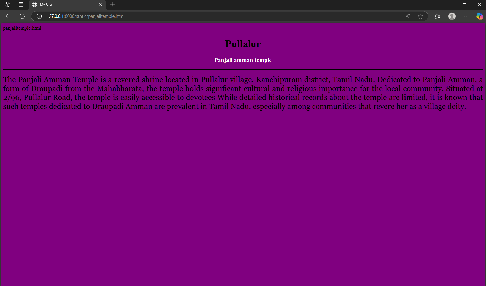

# Ex04 Places Around Me
## Date:22/4/25 

## AIM
To develop a website to display details about the places around my house.

## DESIGN STEPS

### STEP 1
Create a Django admin interface.

### STEP 2
Download your city map from Google.

### STEP 3
Using ```<map>``` tag name the map.

### STEP 4
Create clickable regions in the image using ```<area>``` tag.

### STEP 5
Write HTML programs for all the regions identified.

### STEP 6
Execute the programs and publish them.

## CODE
```
 map.html

<html>
    <head>
        <title> My City</title>
    </head>
    <body>
        <h1 align="center">
            <font color="red"><b>Pullalur</b></font>
        </h1>
        <h3 align="center">
            <font color="blue"><b></b></font>
        </h3>
        <center>
            
	    <map name="image-map">
                <area target="" alt="Pullalur war memorial" title="Pullalur war memorial" href="warmemorial.html" coords="917,0,1171,60" shape="rect">
                <area target="" alt="Amman temple" title="Amman temple" href="ammantemple.html" coords="961,383,1250,459" shape="rect">
                <area target="" alt="Bank" title="Bank" href="bank.html" coords="491,737,718,824" shape="rect">
                <area target="" alt="Murugan hotel" title="Murugan hotel" href="hotel.html" coords="796,571,1020,627" shape="rect">
                <area target="" alt="Temple" title="Temple" href="panjalitemple.html" coords="156,662,349,754" shape="rect">
            </map>
        </center>
    </body>
</html>
```
```
warmemorial.html

<html>
    <head>
        <title> My City</title>
    </head>
    <body bgcolor="cyan">
        <h1 align="center">
            <font color="red"><b>Pullalur</b></font>
        </h1>
        <h3 align="center">
            <font color="black"><b>warmemorial</b></font>
        </h3>
        <hr size="3" color="red">
        <p align="justify">
            <font face="Georgia" size="5">
                The Pullalur War Memorial, located near Kanchipuram in Tamil Nadu, commemorates two significant battles fought in the area. The first, in 618–619 CE, was between the 			Pallava king Mahendravarman I and the Chalukya king Pulakeshin II, with historical accounts offering differing views on the outcome. The second and more well-known battle 		occurred in 1780 during the Second Anglo-Mysore War, when Tipu Sultan and his father Hyder Ali decisively defeated British forces led by Colonel William Baillie. This was a 		major blow to the British East India Company. In memory of British officers who died in the conflict—particularly Lieutenant Colonel George Brown and Captain James Hislop—		two obelisks were erected at the site. These monuments still stand today in the midst of paddy fields near Pullalur village.            
           </font>
        </p>
    </body>
</html>
```
```
ammantemple.html

<html>
    <head>
        <title> My City</title>
    </head>
    <body bgcolor="blue">
        <h1 align="center">
            <font color="black"><b>pullalur</b></font>
        </h1>
        <h3 align="center">
            <font color="white"><b>Amman temple</b></font>
        </h3>
        <hr size="3" color="red">
        <p align="justify">
            <font face="Georgia" size="5">
                The Pullalur Amman Temple is a modest yet culturally significant shrine located in the village of Pullalur in Kanchipuram district, Tamil Nadu. While detailed historical               		records about this specific temple are limited, it is one of several temples in the area that reflect the region's rich religious heritage. Pullalur is also known for other 		temples such as the Sri Varadharaja Perumal Temple and the Kailasanathar Temple, which date back to the Pallava period and feature inscriptions and architectural elements 		from that era.
            </font>
        </p>
    </body>
</html>
```
```
panjalitemple.html

<html>
    <head>
        <title> My City</title>
    </head>
    <body bgcolor="purple">
        <h1 align="center">
            <font color="black"><b>Pullalur</b></font>
        </h1>
        <h3 align="center">
            <font color="white"><b>Panjali amman temple</b></font>
        </h3>
        <hr size="3" color="black">
        <p align="justify">
            <font face="Georgia" size="5">
                The Panjali Amman Temple is a revered shrine located in Pullalur village, Kanchipuram district, Tamil Nadu. Dedicated to Panjali Amman, a form of Draupadi  from the 			Mahabharata, the temple holds significant cultural and religious importance for the local community. Situated at 2/96, Pullalur Road, the temple is easily accessible to 		devotees While detailed historical records about the temple are limited, it is known that such temples dedicated to Draupadi Amman are prevalent in Tamil Nadu, especially 		among communities that revere her as a village deity.            
	    </font>
        </p>
    </body>
</html>
```
```
Bank.html

<html>
    <head>
        <title> My City</title>
    </head>
    <body bgcolor="yellow">
        <h1 align="center">
            <font color="white"><b>Pullalur</b></font>
        </h1>
        <h3 align="center">
            <font color="yellow"><b>Bank</b></font>
        </h3>
        <hr size="3" color="red">
        <p align="justify">
            <font face="Georgia" size="5">
                Pullalur, a village in the Walajabad block of Kanchipuram district, Tamil Nadu, has limited banking facilities within its immediate vicinity. According to available data, 		Indian Bank serves as the primary banking institution in the area, with a significant number of accounts held by local residents. Additionally, there are a few accounts 		associated with other banks such as Canara Bank, Bank of Baroda, Bank of India, and State Bank of India. For more comprehensive banking services, residents may need to 		travel to nearby towns like Walajabad or Kanchipuram, where branches of major banks including HDFC Bank, Axis Bank, and City Union Bank are located . 


            </font>
        </p>
    </body>
</html>
```

## OUTPUT






## RESULT
The program for implementing image maps using HTML is executed successfully.
